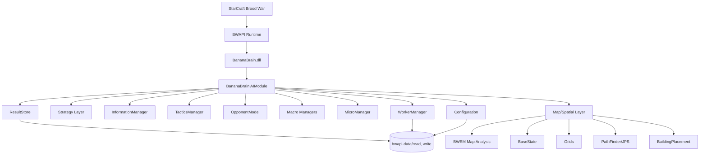
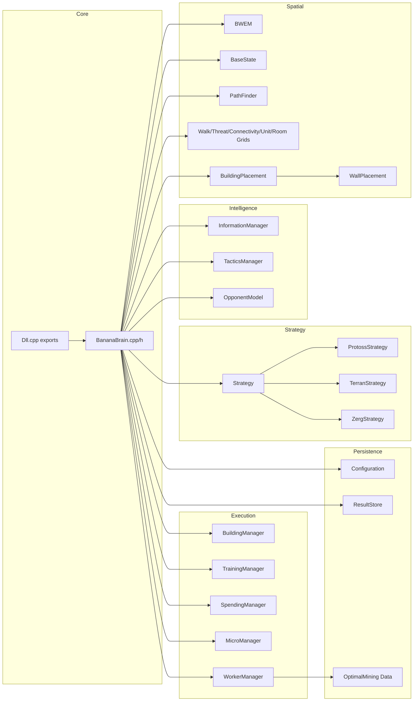
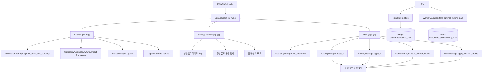
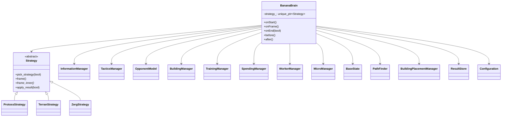
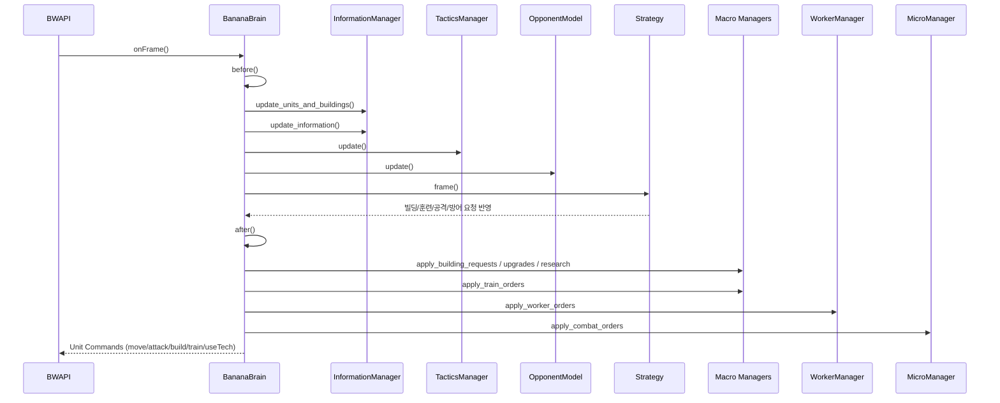

# BananaBrain (BWAPI StarCraft Brood War AI Bot)


StarCraft: Brood War 환경에서 동작하는 고도화된 멀티-종족(Protoss/Terran/Zerg) AI 봇입니다.  
이 프로젝트는 단순 빌드오더 스크립트가 아니라, **프레임 단위 전장 인지(Information/Tactics/Opponent Model) + 전략 선택(ResultStore/UCB1) + 거시 운영(Macro/Worker/Building/Training) + 전투 미시제어(Micro/Spell/Pathing)** 를 통합한 실전형 RTS AI 엔진입니다.

핵심적으로 다음을 제공합니다.
- BWAPI 콜백 기반의 실시간 의사결정 루프
- 맵 분석(BWEM)과 그리드 기반 위협/연결성 평가
- 상대 오프닝 감지 및 대응 모드 전환
- 종족별 방대한 오프닝 풀과 학습형 전략 선택(UCB1/Greedy)
- 광범위한 유닛/스킬 마이크로 및 일꾼 최적 채광 학습 데이터 저장

---

## ✨ Key Features

### 1) 멀티 종족 전략 엔진 (Protoss / Terran / Zerg)
`BananaBrain::onStart()`에서 플레이 종족에 맞는 전략 클래스를 동적으로 선택합니다.
- Protoss: `ProtossStrategy`
- Terran: `TerranStrategy`
- Zerg: `ZergStrategy`

각 전략은 `pick_strategy(bool is_1v1)`를 통해 오프닝 풀에서 빌드를 선택하고, `frame_inner()`에서 상황별 모드 전환(러시 방어, 캐논러시 대응, 메인 매크로 운영 등)을 수행합니다.

### 2) 학습형 오프닝 선택 (ResultStore)
`ResultStore`는 과거 전적(`Results_*.txt`)을 읽어 전략 선택에 반영합니다.
- Greedy: 누적 성능 기반
- UCB1: 탐색/활용 균형 기반 멀티암드 밴딧

`Configuration`의 `ucb1=true` 또는 사람 상대 플래그에서 UCB1을 사용하며, 대회 모드(`tournament=true`)에서는 감쇠 파라미터를 다르게 적용합니다.

### 3) 프레임 파이프라인 기반 아키텍처
`onFrame()`는 다음 순서를 강제합니다.
1. `before()` 데이터 수집/상태 갱신
2. `strategy_->frame()` 전략 의사결정
3. `after()` 자원 집행/명령 실행
4. 디버그 드로잉 및 성능 측정

이 분리 덕분에 인지-판단-실행 단계가 명확하며, 모듈 간 책임 분리가 좋습니다.

### 4) 전장 인지 및 전술 추론
- `InformationManager`: 아군/적/중립 유닛 상태 추적, 적 업그레이드/완료 유닛 카운트
- `TacticsManager`: 아군/적 공급력(공격/방어/대공) 추정, 적 군집(`EnemyCluster`) 형성
- `OpponentModel`: 타이밍 기반 오프닝 분류(저그/테란/프로토스 각각 다수 패턴)

### 5) 맵 분석 및 경로/배치 최적화
- BWEM 통합으로 지역/초크/베이스 정보를 확보
- `PathFinder` + JPS 기반 이동 최적화
- `BuildingPlacementManager`의 FFE/테란 월/포톤캐논-터렛-크립 방어 배치
- `ThreatGrid`/`ConnectivityGrid`를 통한 실시간 위험/연결성 판단

### 6) 고급 마이크로 제어
`MicroManager`는 유닛 카테고리별 제어와 스킬 의사결정(Storm, Stasis, Plague, EMP, Irradiate, Scan, Mine, Yamato 등)을 수행합니다.  
전투 유닛별 상태(`CombatState`), 타깃 전환 정책, 기동/후퇴 조건을 분리해 미시 제어를 구현합니다.

### 7) 일꾼 운영 + 최적 채광 데이터 지속화
`WorkerManager`는 채광/건설/정찰/방어/수리/전투 일꾼을 통합 관리하며, 맵 해시별 `OptimalMining_*.txt`를 읽고 쓰면서 채광 효율을 개선합니다.

---

## 🛠 Tech Stack

| 항목 | 내용 | 선택 이유 |
|---|---|---|
| 언어 | C++17 (`stdcpp17`) | 고성능 실시간 의사결정/저수준 제어 |
| AI 런타임 | BWAPI 4.4.0 | StarCraft: Brood War 봇 개발 표준 API |
| 맵 분석 | BWEM (수정본) | 베이스/지형/초크 분석 및 경로 의사결정 근간 |
| 빌드 시스템 | Visual Studio C++ Project (`.vcxproj`) | BWAPI 연동 및 DLL 산출에 최적 |
| 플랫폼 | Windows Win32 (x86 DLL) | BWAPI/게임 런타임 호환 |
| 출력물 | `BananaBrain.dll` | BWAPI AI 모듈 로딩 규격 |
| 구성 파일 | `Configuration.txt`, `schnail.env` | 런타임 전략/디버그/모드 제어 |
| 데이터 저장 | `Results_*.txt`, `OptimalMining_*.txt` | 전략 선택 학습 및 채광 최적화 |

### 빌드/링크 관련 핵심 설정
- Toolset: `v143`
- Output: `DynamicLibrary`
- Include: `$(BWAPI_DIR)/include`, `BWEM`
- Link: `$(BWAPI_DIR)/Release/BWAPILIB.lib` 또는 Debug 버전
- Target: `Win32`

---

## 📁 Project Structure

아래는 실제 리포지토리 구조를 기준으로 정리한 상세 트리입니다.

```text
BananaBrainAIIDE2024/
├─ readme.txt                         # 원본 배포/빌드 안내
├─ AI/                                # 배포 시 DLL/설정/학습 데이터가 위치(현재 워크스페이스는 비어있음)
└─ src/
   ├─ BananaBrain.sln                 # Visual Studio 솔루션
   ├─ BananaBrain.vcxproj             # C++ DLL 프로젝트 설정
   ├─ BananaBrain.vcxproj.user        # 로컬 사용자 설정
   ├─ Debug/                          # Debug 산출물
   ├─ Release/                        # Release 산출물
   ├─ BananaBrain/                    # 중간 산출물 디렉터리
   ├─ BWEM/                           # BWEM-community 수정본
   │  ├─ bwem.h / bwem.cpp            # BWEM 엔트리
   │  ├─ map*.{h,cpp}                 # 맵 분석/구성
   │  ├─ area/base/cp/*.h/.cpp        # 영역/베이스/초크포인트 모델
   │  ├─ gridMap.*, neutral.*, tiles.*
   │  └─ LICENSE                      # BWEM 라이선스
   └─ Source/
      ├─ Dll.cpp                      # BWAPI exports(gameInit/newAIModule)
      ├─ BananaBrain.h/.cpp           # 메인 AIModule, 프레임 루프
      ├─ Strategy.h/.cpp              # 전략 공통 베이스
      ├─ ProtossStrategy.cpp          # 프로토스 전략군
      ├─ TerranStrategy.cpp           # 테란 전략군
      ├─ ZergStrategy.cpp             # 저그 전략군
      ├─ Configuration.h/.cpp         # 설정 파일 로드/파싱
      ├─ Results.h/.cpp               # 전략 전적 저장/선택(UCB1/Greedy)
      ├─ Information.h/.cpp           # 유닛 정보 레이어
      ├─ Tactics.h/.cpp               # 전술 추론/군집/공급력 계산
      ├─ OpponentModel.h/.cpp         # 상대 오프닝 모델
      ├─ Macro.h/.cpp                 # Building/Training/Spending 매니저
      ├─ Micro.h/.cpp                 # 전투 마이크로 및 스킬 제어
      ├─ Worker.h/.cpp                # 일꾼 운영/채광/정찰/건설
      ├─ BaseState.h/.cpp             # 베이스/영역/보더 상태
      ├─ Grids.h/.cpp                 # Walkability/Threat/Connectivity/Unit/Room 그리드
      ├─ PathFinder.h/.cpp            # 경로 탐색/JPS 래퍼
      ├─ BuildingPlacement.h/.cpp     # 건물 배치/월 구성
      ├─ WallPlacement.h/.cpp         # 벽/갭 모델링
      ├─ UnitPotential.h/.cpp         # 퍼텐셜 필드 이동
      ├─ UnitUtils.h/.cpp, Utils.h    # 유틸리티
      ├─ FastPosition.h/.cpp          # 경량 위치 타입
      ├─ JPS.h                        # Jump Point Search 구현
      ├─ License.txt                  # BananaBrain 라이선스
      └─ Source.zip                   # 소스 패키지(배포 잔재)
```

### 모듈 책임 요약
- 제어축: `BananaBrain`
- 전략축: `Strategy` + 종족별 전략 구현
- 인지축: `Information` + `OpponentModel` + `Tactics`
- 집행축: `Macro` + `Micro` + `Worker`
- 공간축: `BWEM` + `BaseState` + `Grids` + `PathFinder` + `BuildingPlacement`
- 학습축: `Results` + `OptimalMining`

---

## 🚀 Installation

> 본 프로젝트는 **Windows + StarCraft: Brood War + BWAPI 4.4.0 + Visual Studio C++ 환경**을 전제로 합니다.

### 1) 사전 준비물
1. StarCraft: Brood War 실행 환경
2. BWAPI 4.4.0 설치
3. Visual Studio (C++ 데스크톱 개발 도구 포함)
4. Win32 빌드 가능한 MSVC Toolchain

### 2) 환경 변수 설정
`BWAPI_DIR`를 BWAPI 루트로 설정해야 `.vcxproj`의 include/lib 경로가 해석됩니다.

PowerShell 예시:
```powershell
setx BWAPI_DIR "D:\bwapi\bwapi-4.4.0"
```

설정 후 새 터미널/IDE 세션을 열어 반영합니다.

### 3) 솔루션 열기 및 빌드
1. `src/BananaBrain.vcxproj` 또는 `src/BananaBrain.sln`을 Visual Studio에서 엽니다.
2. 구성: `Release | Win32`
3. `Build Solution` 실행
4. 결과물: `src/Release/BananaBrain.dll`

### 4) BWAPI 봇 폴더 배치
일반적으로 `bwapi-data/AI/`에 다음을 배치합니다.
- `BananaBrain.dll`
- `Configuration.txt`
- (선택) `Results_*.txt`, `OptimalMining_*.txt`

### 5) 런타임 파일 디렉터리 정책
코드가 실제로 참조하는 경로는 아래와 같습니다.
- 설정 읽기
  - `bwapi-data\AI\Configuration.txt`
  - `bwapi-data\read\Configuration.txt`
- 사람 상대 감지용 플래그 파일
  - `bwapi-data\read\schnail.env`
- 전략 전적
  - 읽기: `bwapi-data\read\Results_<상대명>.txt` (없으면 write fallback)
  - 쓰기: `bwapi-data\write\Results_<상대명>.txt`
- 최적 채광
  - 읽기: `bwapi-data\read\OptimalMining_<mapHash>.txt`
  - 쓰기: `bwapi-data\write\OptimalMining_<mapHash>.txt`

### 6) `.env` 예시 (프로젝트 관점)
이 프로젝트는 표준 `.env` 파서를 쓰지는 않지만, 운영 문서화 관점에서 아래와 같이 관리하는 것을 권장합니다.

```env
# example.env (운영 참고)
BWAPI_DIR=D:\bwapi\bwapi-4.4.0
BOT_DLL=BananaBrain.dll
RUNTIME_MODE=tournament
ENABLE_DRAW=false
ENABLE_UCB1=true
```

그리고 실제 봇 동작은 `Configuration.txt`로 제어합니다.

### 7) `Configuration.txt` 예시
```ini
draw=false
ucb1=true
tournament=true

# 강제 오프닝(선택)
PvZ_opening=PvZ_bisu
PvT_opening=PvT_10/12gate
PvP_opening=PvP_nzcore
TvZ_opening=TvZ_Fantasy
TvT_opening=TvT_2factvults
TvP_opening=TvP_GundamRush
ZvZ_opening=ZvZ_9PoolSpire
ZvT_opening=ZvT_3HatchMuta
ZvP_opening=ZvP_9734
```

---

## 💡 Usage

### 시나리오 A: 1v1 래더/토너먼트 모드 운영
목표: 전적 기반으로 오프닝 자동 선택 + 대회 모드 감쇠 적용

1. `Configuration.txt`에 아래 설정
```ini
ucb1=true
tournament=true
draw=false
```
2. `bwapi-data/read` 또는 `write`에 기존 `Results_*.txt` 유지
3. 게임 반복 실행
4. `Results_*.txt` 누적을 통해 전략 선택 분포가 안정화

효과:
- 미시적 변동성보다 장기 승률 향상에 집중
- 미플레이 전략 탐색 및 우수 전략 활용 균형

### 시나리오 B: 특정 매치업 오프닝 강제 테스트
목표: 새 오프닝 실험 또는 회귀 테스트

```ini
ucb1=false
tournament=false
PvZ_opening=PvZ_neobisu
```

효과:
- 동일 조건 반복 실험 가능
- 리플레이 비교가 쉬워짐

### 시나리오 C: 디버깅/분석 모드
목표: 프레임 지표/전술 상태 시각 확인

```ini
draw=true
```

`onFrame()`에서 드로잉이 활성화되어 다음 정보가 화면에 출력됩니다.
- 프레임 처리 시간
- 수급/훈련 비용/가용 자원
- 아군/적군 공급력 비교
- 현재 모드, 오프닝, 후반 전략, 적 오프닝 추정

### 시나리오 D: 채광 최적화 학습 누적
목표: 맵별 일꾼 경로/속도 데이터를 누적해 채광 효율 개선

동작 방식:
- 시작 시 `WorkerManager::init_optimal_mining_data()`가 파일 로드
- 종료 시 `store_optimal_mining_data()`가 결과 저장
- 맵 해시 기준 파일 분리 (`OptimalMining_<mapHash>.txt`)

---

## 🏗 Architecture

### 아키텍처 개요
BananaBrain은 이벤트 주도(BWAPI callback) 구조 위에 **매니저 싱글턴 + 전략 다형성 + 그리드 기반 공간 추론**을 얹은 구조입니다.

핵심 설계 포인트:
1. 엔트리 모듈(`BananaBrain`)은 오케스트레이터 역할만 수행
2. 도메인별 매니저는 싱글턴으로 상태를 공유
3. 전략(`Strategy`)은 종족별 정책/빌드오더를 캡슐화
4. 인지(`Information/Opponent/Tactics`)와 실행(`Macro/Micro/Worker`)을 분리
5. 전적/채광 데이터로 경험적 적응 수행

### 프레임 내부 상호작용
- `before()`
  - 정보 수집, 그리드 업데이트, 전술 추론, 상대 모델 업데이트
- `strategy_->frame()`
  - 방어/공격/확장/테크/훈련 요청 결정
- `after()`
  - 자원 집행(건설/업글/연구/훈련), 일꾼 명령, 전투 명령 실행

### 주요 싱글턴 관계
- `Configuration` → 설정 공급
- `BaseState`/`BWEM`/`PathFinder`/`Grids` → 공간/지형 기반 의사결정
- `Information`/`OpponentModel`/`Tactics` → 상태 추론
- `BuildingManager`/`TrainingManager`/`SpendingManager`/`WorkerManager`/`MicroManager` → 행동 집행
- `ResultStore` → 전략 선택/학습 데이터

---

## 📊 Diagrams

### 1) High-level System Architecture Diagram


### 2) Component / Module Diagram


### 3) Data Flow Diagram


### 4) Class Diagram


### 5) Sequence Diagram (가장 중요한 사용자 흐름: 프레임 의사결정)


### 6) Additional Diagram: Strategy Selection (UCB1/Greedy)
```mermaid
flowchart LR
    S[가능 오프닝 목록] --> P{ucb1 또는 human_opponent?}
    P -- Yes --> U[UCB1 점수 계산]
    P -- No --> G[Greedy 추정치 계산]

    U --> R1[미플레이 전략 우선 탐색]
    U --> R2[score = winrate + sqrt(2lnN/n)]

    G --> R3[감쇠 가중 승률 추정]
    G --> R4[최대 추정치 전략 선택]

    R1 --> X[무작위 tie-break]
    R2 --> X
    R3 --> X
    R4 --> X
    X --> O[선택된 opening_]
```

---

## 📡 API Reference

이 프로젝트는 외부 REST API를 제공하지 않으며, **BWAPI의 AIModule 콜백 인터페이스**를 구현합니다.

### Exported DLL 인터페이스 (`Dll.cpp`)
```cpp
extern "C" __declspec(dllexport) void gameInit(BWAPI::Game* game);
extern "C" __declspec(dllexport) BWAPI::AIModule* newAIModule();
```

### AIModule 콜백
- `onStart()`
- `onEnd(bool isWinner)`
- `onFrame()`
- `onUnitDiscover(Unit)`
- `onUnitDestroy(Unit)`
- `onUnitMorph(Unit)`
- `onUnitComplete(Unit)`
- 기타 텍스트/플레이어/핵 탐지 이벤트

### 내부 의사결정 API (주요 예)
- 전략 선택: `ResultStore::pick_strategy(...)`
- 건설 요청: `BuildingManager::set_requested_building_count_at_least(...)`
- 훈련 분포: `TrainingManager::{gateway,factory,larva}_train_distribution()`
- 전투 집행: `MicroManager::apply_combat_orders()`
- 일꾼 집행: `WorkerManager::apply_worker_orders()`

---

## 🧪 How to Run Tests / Development

이 저장소에는 일반적인 단위 테스트 프레임워크(예: GoogleTest) 기반 테스트 스위트가 포함되어 있지 않습니다.  
따라서 검증은 **빌드 성공 + 게임 내 동작 검증 + 리플레이 분석** 중심으로 수행해야 합니다.

### 권장 개발 루프
1. 코드 수정
2. `Release|Win32` 빌드
3. `BananaBrain.dll` 배포 경로 반영
4. 게임 실행 후 리플레이/로그/드로잉 확인
5. `Results_*.txt`, `OptimalMining_*.txt` 변화 점검

### 최소 스모크 체크리스트
- 봇이 정상 로딩되는가
- `onStart()`에서 종족 전략이 정상 선택되는가
- `onFrame()` 루프가 중단 없이 동작하는가
- 빌딩/훈련/일꾼/전투 명령이 실제 발행되는가
- 게임 종료 시 결과 파일 저장이 수행되는가

### 디버그 팁
- `draw=true`로 화면 정보 활성화
- `bwapi-data/write`의 텍스트 산출물을 보조 지표로 활용

---

## 🤝 Contributing Guidelines

프로젝트 성격상(경쟁형 RTS AI), 성능/정확도/안정성 회귀가 잦기 때문에 다음 원칙을 권장합니다.

1. 작은 단위 PR
- 전략 로직, 마이크로 로직, 배치/경로 로직을 한 PR에 섞지 않기

2. 변경 의도 명확화
- 어떤 매치업/상황을 개선하려는지 명시
- 기대 KPI(승률, 특정 타이밍 생존률, 프레임 시간) 제시

3. 구성 파일로 실험 분리
- 코드 변경 없이 `Configuration.txt`로 실험 가능한 항목은 분리

4. 재현 가능한 검증
- 맵/종족/시드/상대 조건을 문서화
- 리플레이 또는 결과 파일 일부 첨부

5. 성능 회귀 방지
- 프레임 시간 증가 여부 확인
- 특히 `onFrame()->before()/after()`의 반복 루프 연산 주의

---

## 📄 License

이 프로젝트는 복합 라이선스 구조를 가집니다.

1. BananaBrain (`src/Source/License.txt`)
- MIT 유사 허가 조항 + 추가 제한
- **저자 서면 허가 없이 공개 StarCraft 대회 제출 금지** 조항 포함

2. BWEM (`src/BWEM/LICENSE`)
- MIT/X11 License

실제 배포/대회 사용 전 반드시 원문 라이선스를 직접 검토하세요.

---

## 🙏 Acknowledgments

- Johan de Jong: BananaBrain 원 저자
- BWAPI 커뮤니티: StarCraft AI 개발 표준 런타임 제공
- BWEM-community / Igor Dimitrijevic: 고품질 맵 분석 라이브러리
- StarCraft AI 연구/토너먼트 생태계: 전략/전술 진화의 기반

---

## 부록: 주요 워크플로우 요약

### 게임 시작 시
1. 종족별 전략 객체 선택
2. `Configuration` 로드
3. BWEM 맵 초기화 및 베이스 탐색
4. `BaseState`, `PathFinder`, `OpponentModel`, `BuildingPlacement` 초기화
5. 1v1이면 `ResultStore` 초기화 및 전략 선택
6. 워커 최적 채광 데이터 로드

### 프레임마다
1. 유닛/지형/위협/상대 정보 갱신
2. 전략 판단(공격/방어/확장/기술)
3. 자원 집행 우선순위에 따른 건설/업글/훈련 실행
4. 일꾼/전투 유닛 명령 적용

### 게임 종료 시
1. 결과 적용 및 `Results_*.txt` 저장 (1v1)
2. `OptimalMining_*.txt` 저장

이 문서는 코드베이스의 실제 구조와 구현 흐름을 기준으로 작성되었습니다.